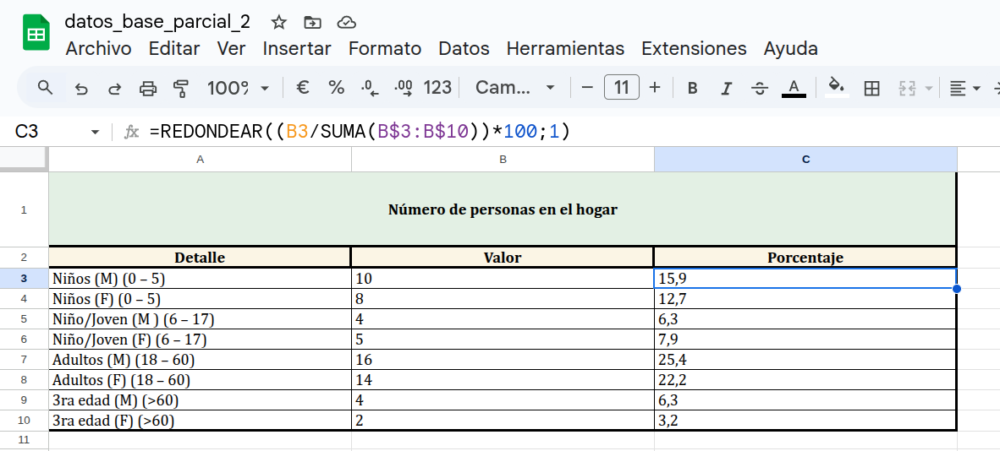
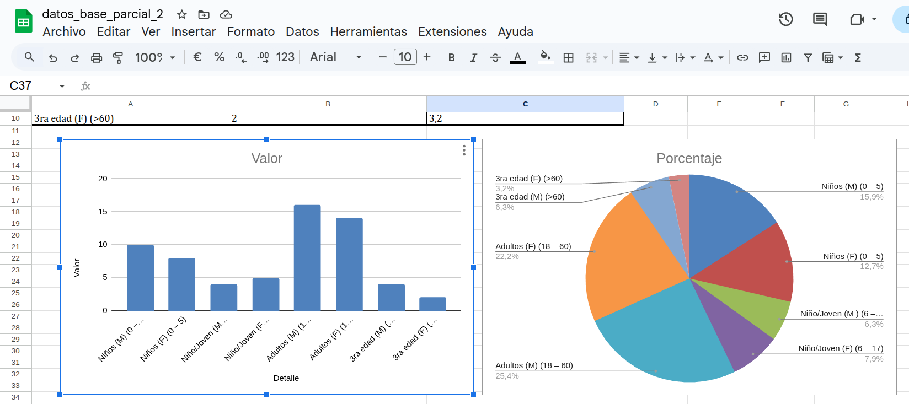
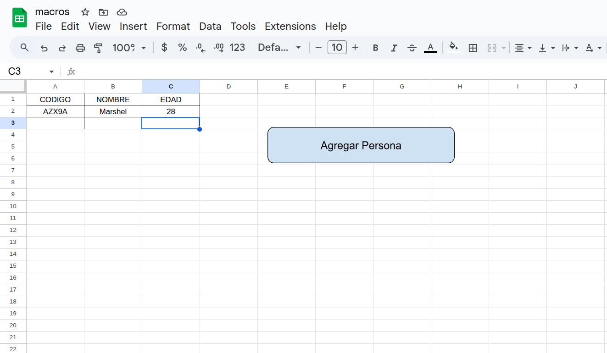
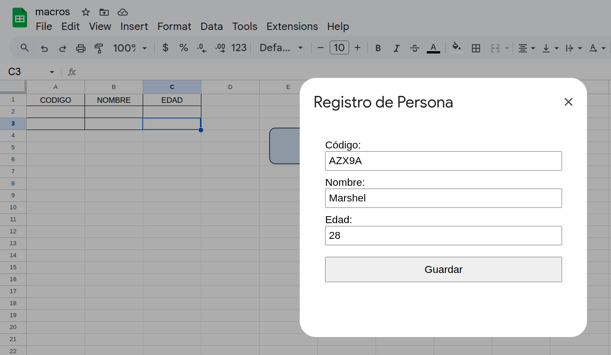

# Examen Parcial 2

## Datos del Estudiante

- **Nombre completo:** Marshel Aillón
- **Carrera:** Sistemas Informáticos
- **Materia:** Ofimática y Tecnología Multimedia
- **Fecha:** 11/06/2025

---

## Parte 2: Tablas y Gráficas

A continuación se presentan capturas de pantalla que muestran el desarrollo de la Parte 2, que incluye las **tablas de datos procesados** y las **gráficas generadas**.

### 📊 Tabla de datos

### 📈 Gráfica 1 y 2

---

## Parte 3: Tabla y Formulario en Google Sheets

En esta sección se muestra la implementación de una **tabla para registrar personas** y el **formulario personalizado** creado con Apps Script.

### 📝 Tabla de registros

### 🧾 Formulario de ingreso

